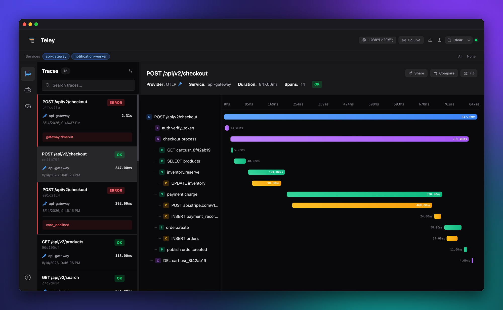
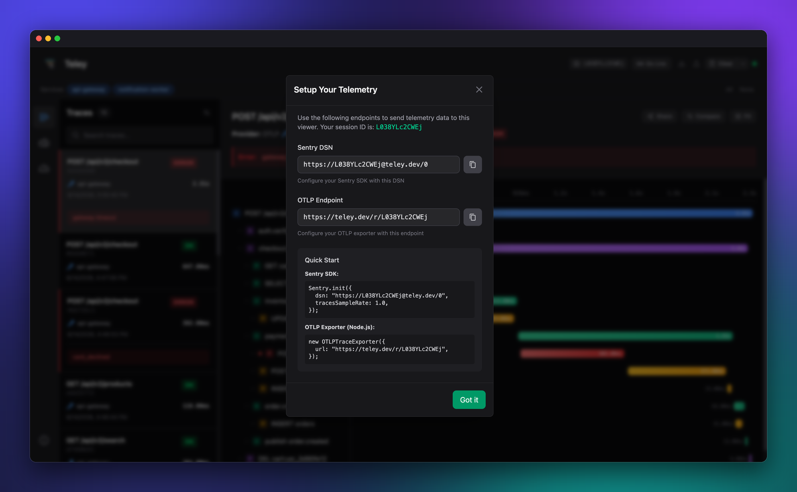
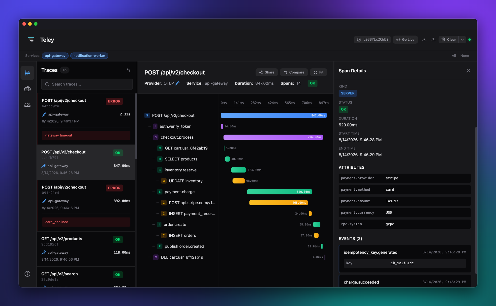
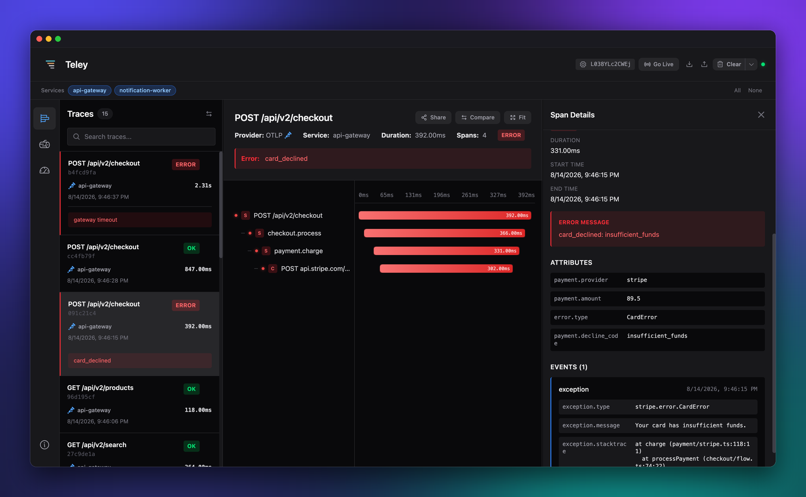
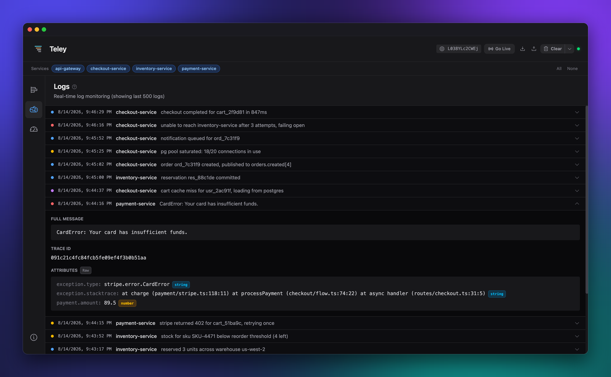
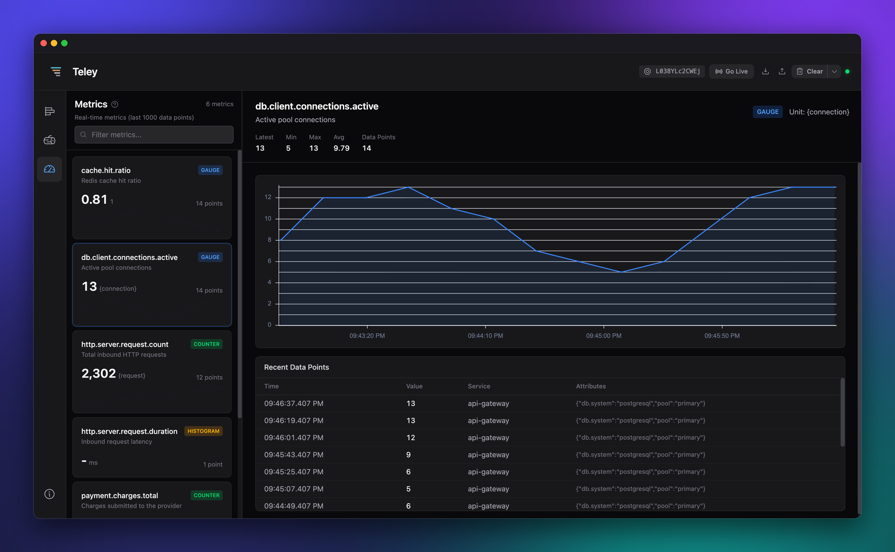
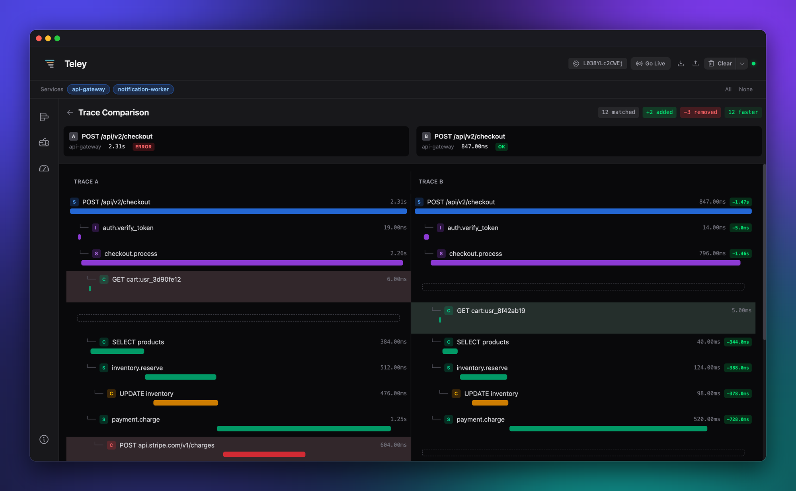

<p align="center">
  
</p>

<h1 align="center">Teley</h1>

<p align="center">
  A real-time viewer for traces, logs, and metrics, for you and your agents. Point any OpenTelemetry or Sentry SDK at a room and watch it stream in.
</p>

<p align="center">
  <a href="https://teley.dev"></a>
  <a href="https://www.npmjs.com/package/teley-cli"></a>
  
</p>

<p align="center">
  
</p>

<p align="center">
  <a href="#-get-started-in-under-a-minute">Quickstart</a> •
  <a href="#-send-your-data">Send data</a> •
  <a href="#-what-you-get">Features</a> •
  <a href="#-self-host">Self-host</a>
</p>

---

Teley is a zero-setup observability dashboard. Every session gets its own room with a unique DSN, and telemetry sent there appears instantly. No account, no database to run.

Three ways in, same room:

- **Web** at [teley.dev](https://teley.dev) for the full dashboard: waterfall traces, logs, metrics, and side-by-side trace comparison.
- **Terminal** via `teley-cli` for a live waterfall and metric charts without leaving your shell.
- **Agents** via `teley-cli mcp`, which hands the room to a coding agent over MCP.

## ⚡ Get started in under a minute

### On the web

1. Open **[teley.dev](https://teley.dev)**. A room is created for you instantly. No signup.
2. Click your **session ID** in the header to copy your DSN and OTLP endpoint.
3. Point your app's Sentry or OpenTelemetry SDK at it (see [Send your data](#-send-your-data)).
4. Run your app. Traces, logs, and metrics stream in live.

<p align="center">
  
</p>

### In your terminal

```bash
bunx teley-cli          # live room, waterfall in your terminal
bunx teley-cli mcp      # serve the room to a coding agent over MCP
bunx teley-cli --demo   # sample data, no network
```

The DSN is printed in the header. Point your SDK at it, run your app, and watch spans arrive.

> The TUI needs FFI, so either [Bun](https://bun.sh), or Node 26.4+ with `node --experimental-ffi` are needed. Everything else (`--json`, `mcp`, `--local`) runs on Node/Bun alike.

## 📡 Send your data

Both protocols point at the same room. Swap in the session ID from the header (`<room-id>` below).

### Sentry SDK

Set your DSN. The project ID at the end can be anything.

```javascript
import * as Sentry from '@sentry/browser';

Sentry.init({
  dsn: 'https://<room-id>@teley.dev/0',
  tracesSampleRate: 1.0,
  integrations: [Sentry.browserTracingIntegration()],
});
```

Transactions become traces and errors become logs, tagged with a `SENTRY` badge.

### OpenTelemetry (OTLP over HTTP)

Export to `https://teley.dev/r/<room-id>`:

```javascript
import { OTLPTraceExporter } from '@opentelemetry/exporter-trace-otlp-http';
import { NodeTracerProvider } from '@opentelemetry/sdk-trace-node';
import { SimpleSpanProcessor } from '@opentelemetry/sdk-trace-base';

const provider = new NodeTracerProvider();
provider.addSpanProcessor(
  new SimpleSpanProcessor(
    new OTLPTraceExporter({ url: 'https://teley.dev/r/<room-id>' }),
  ),
);
provider.register();
```

> Both encodings work: send JSON or protobuf, gzipped or not, to the same URL. Traces, logs and metrics all go to that one endpoint, so point every exporter at it.

<details>
<summary>Python, and pointing at a local worker</summary>

**Python (OTLP)**

```python
from opentelemetry import trace
from opentelemetry.sdk.trace import TracerProvider
from opentelemetry.sdk.trace.export import SimpleSpanProcessor
from opentelemetry.exporter.otlp.proto.http.trace_exporter import OTLPSpanExporter

provider = TracerProvider()
provider.add_span_processor(
    SimpleSpanProcessor(OTLPSpanExporter(endpoint="https://teley.dev/r/<room-id>"))
)
trace.set_tracer_provider(provider)
```

**Endpoints per room**

| Purpose     | Endpoint                        |
| ----------- | ------------------------------- |
| Sentry DSN  | `https://<room-id>@teley.dev/0` |
| OTLP ingest | `https://teley.dev/r/<room-id>` |

Running your own worker? Swap `teley.dev` for your host, or use `teley-cli --host localhost:8787` for the CLI.

</details>

## ✨ What you get

- **Waterfall traces.** Time-proportional span bars with a real hierarchy, span-kind badges (server/client/internal/producer/consumer), and color-coded errors.
- **Span details.** ID, parent, kind, status, timing, attributes, events, and links. One click from any span.
- **Live logs.** Real-time stream with severity coloring (`TRACE` through `FATAL`), expandable rows, and trace/span correlation.
- **Metrics.** Counters, gauges, histograms, and sets, charted as they arrive, in the dashboard and in the terminal alike.
- **Trace comparison.** Line up two traces side by side. Spans are aligned with an LCS diff, and the differences in structure, duration, and attributes are called out.
- **Two protocols, one view.** OTLP and Sentry envelopes land in the same unified timeline.
- **Readable by agents.** `teley-cli mcp` hands the same room to a coding agent as MCP tools, so it can run your app and read the span tree back.
- **Local-first.** Everything is stored in your browser.
- **Live mode.** Auto-select the newest trace as it arrives, so the latest activity is always in front of you.

<p align="center">
  
  <br><em>Click any span for its ids, kind, status, timing, attributes, events, and links.</em>
</p>

<p align="center">
  
  <br><em>Failures are colored down the whole path, with the exception event and stack trace on the span that threw.</em>
</p>

<p align="center">
  
  <br><em>Logs stream in with severity coloring. Expand a row for the full message, trace id, and typed attributes.</em>
</p>

<p align="center">
  
  <br><em>Counters, gauges, histograms, and sets are charted as they arrive.</em>
</p>

<p align="center">
  
  <br><em>Compare two traces: spans are aligned with an LCS diff, and added, removed, and slower spans are called out.</em>
</p>

<details>
<summary>CLI keyboard shortcuts</summary>

| Key                      | Action                                        |
| ------------------------ | --------------------------------------------- |
| `←` / `→`                | Cycle Traces, Logs, and Metrics               |
| `↑` / `↓` (or `j` / `k`) | Navigate the focused panel                    |
| `tab`                    | Cycle focus: list → detail → connection links |
| `↵` / `y`                | Copy the focused DSN or OTLP endpoint         |
| `c`                      | Clear the local view                          |
| `q`                      | Quit                                          |

Run `teley --help` for all flags (`--host`, `--new`, `--demo`, `--json`, `--local`).

</details>

## 🛠 Self-host

Teley is a pnpm monorepo: `web/` (dashboard), `cli/` (terminal viewer), `workers/` (Cloudflare worker), plus shared `shared/` and `types/`.

```bash
pnpm install

# Web dashboard
cd web && pnpm dev            # http://localhost:3000

# Worker (separate terminal)
cd web && pnpm dev:worker     # http://localhost:8787

# CLI against your local worker
cd cli && bun install
bun run dev --host localhost:8787
```

Deploy the worker with `pnpm deploy:worker` and the static site with `pnpm deploy:static` (both from `web/`).

<details>
<summary>Tech stack</summary>

- **Web:** Nuxt 4 (Vue 3 + TypeScript, SSR off), Tailwind CSS v4, Unovis charts, Dexie (IndexedDB), a `SharedWorker` for one WebSocket across tabs.
- **CLI:** [OpenTUI](https://opentui.com) (React bindings) on Bun or Node. Reuses the shared parsers and the web app's `buildSpanTree`.
- **Backend:** Cloudflare Workers + Durable Objects.
- **Shared:** framework-agnostic OTLP and Sentry parsers in `shared/parsers/`, used by the worker, web app, and CLI alike.

</details>

## License

[Apache 2.0](LICENSE). See [NOTICE](NOTICE) for attribution requirements.
